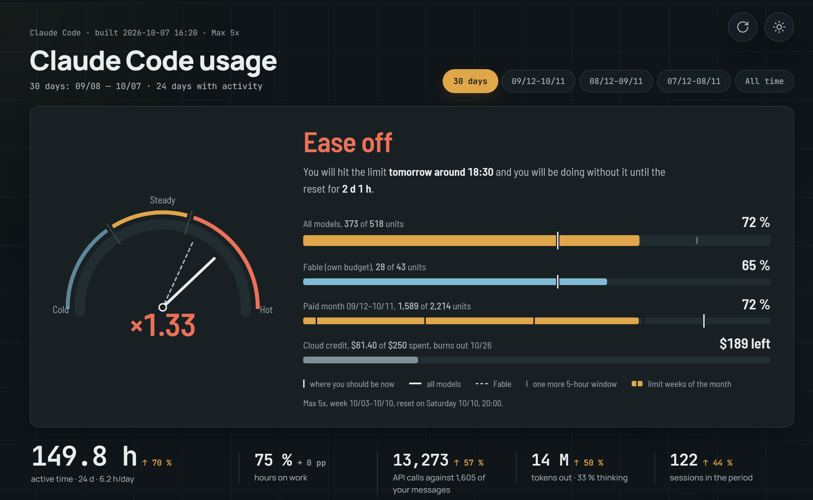
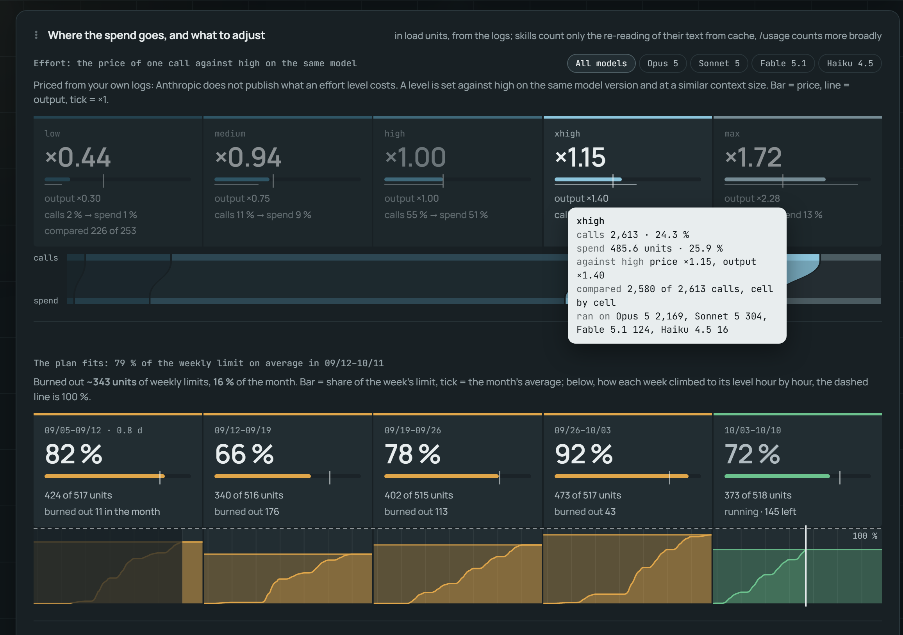
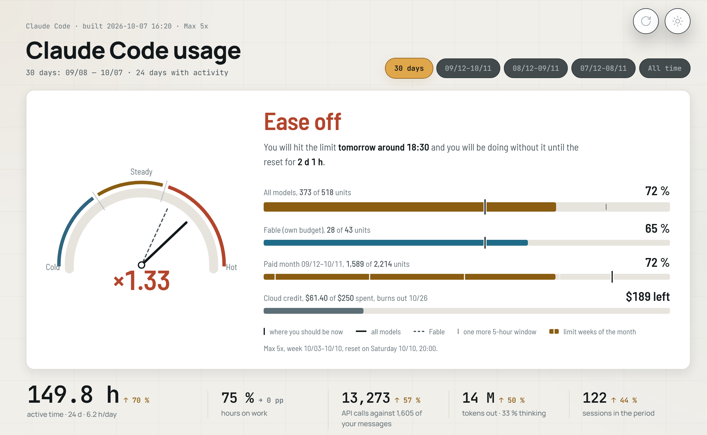

# Claude Code usage dashboard

[](https://pypi.org/project/claude-usage-dashboard/)
[](https://github.com/Thinkpload/claude-code-usage-dashboard/actions/workflows/ci.yml)
[](https://pypi.org/project/claude-usage-dashboard/)
[](LICENSE)

A single self-contained HTML page that answers the questions `/usage` does not: where your Claude
Code hours actually went, which projects ate them, and whether this week's pace lands you on the
weekly limit or wastes half of it.

It reads the session logs Claude Code already writes to `~/.claude/projects/**/*.jsonl`. No account,
no API key, no network. Pure Python, no dependencies.

**[→ Open the live demo](https://thinkpload.github.io/claude-code-usage-dashboard/)** (invented data, the real page) ·
[the whole page in one image](docs/screenshot-full.png)



*[Русская версия README](README.ru.md)*

## What it tells you

- **What does an effort level really cost?** Anthropic does not publish it. The dashboard prices it
  from your own logs, `low` → `max`: one call at each level against a call at `high` on the same model
  version and at a similar context size, so neither a pricier model nor a longer context passes for
  effort. Both the price against your limit and the output it writes, thinking included, for all
  models or one at a time. On one real month: `max` = ×1.59 the price and ×1.91 the output of `high`,
  `medium` = ×0.86; on Fable 5.1 alone `xhigh` costs ×1.56 of `high`, against ×1.14 across models.
- **Am I going to hit the weekly limit?** A calibrated gauge, not a guess: `k = actual ÷ plan`, where
  the plan follows *when you actually work* rather than the calendar. It says things like "you will
  hit the limit on Wednesday around 11:00 and be without it for 1 d 8 h." Ticks on the week's bar
  count the 5-hour windows that still fit before the reset; a cloud-session credit gets a bar of its own.
- **Is my plan the right size?** The paid month laid out week by week: each limit week against its
  own limit, how it climbed hour by hour, what burned out unused, and a verdict — the plan fits, is
  roomy, or sits at its ceiling and a bigger one pays off.
- **Where did the time go?** Active hours per project, grouped three ways (main work / work misc /
  personal), by day, by month, and as a weekday × hour heatmap.
- **What is the spend made of?** Tokens by model, by context size, by effort level, by skill text
  sitting in context, by subagent, by cold session start — each with a concrete suggestion.
- **Did any of it ship?** Commits from your local repos overlaid on the same timeline.



## Quick start

Nothing to install, nothing to clone:

```bash
uvx claude-usage-dashboard --open
```

`pipx run claude-usage-dashboard --open` does the same, and `pip install claude-usage-dashboard`
keeps it around. Or take a copy and run it in place:

```bash
git clone https://github.com/Thinkpload/claude-code-usage-dashboard
cd claude-code-usage-dashboard
python -m claude_usage_dashboard --open
```

Either way it scans your logs, writes `~/.claude/usage-report/`, and opens the page. Scanning a
hundred sessions takes up to a minute; everything after that is instant. Run it again whenever you
want fresh numbers — the page is a plain file, there is no server and no daemon.

On Windows, run it once with `--register-refresh` and the page gets a **refresh** button: it opens a
`claude-usage://` link that reruns the scan in the background, and the page reloads when the new
build lands (the browser asks the first time). Register from a `pip install` or a checkout — a
`uvx`/`pipx run` copy lives in a temporary environment the link would outlive.

Python 3.9+, standard library only. Windows, macOS and Linux.

## Make the weekly limit real

Anthropic does not publish limits in tokens, so any tool claiming to know your exact remaining quota
is guessing. This one calibrates itself against the real `/usage` figure instead.

On every run it fetches that figure the same way Claude Code's own `/usage` panel does: with your
login token from `~/.claude/.credentials.json`, sent to `api.anthropic.com` and nowhere else. The
token is never printed or copied anywhere new. What gets recorded is the "all models" percentage,
the Fable percentage, the moment the week resets, the 5-hour window with its own reset, and the
cloud-session credit when there is one. A rerun within the hour replaces the last reading rather
than adding another.

If you would rather it never touched the token, run with `--no-fetch` and feed the reading yourself
from **claude.ai → Settings → Usage** (or `/usage` in Claude Code):

```bash
claude-usage-dashboard --observe 46 --fable 31 --reset "2026-09-17 20:00"
```

- `--observe` — the "all models" percentage for the current week
- `--fable` — the Fable percentage, which runs on its own separate budget
- `--reset` — when the week rolls over

From each reading the tool solves for your plan's weekly budget in *load units* (tokens weighted by
model and token type) and can then track every later week on its own. Readings pool by size, so a
1 % reading on the first day of a week does not drown the 48 % one from day five. A week that has a
reading of its own follows its latest one, so a limit change nobody announced (a promo, a new model)
cannot pull the gauge away from what `/usage` shows. Until there is a
reading, the gauge says so plainly instead of inventing a number.

The weights are API prices, and the limit does not charge models quite the way the price list does:
per unit, Fable loads it harder than its price says relative to Opus (about twice as hard on one
real month). So the weight of a Fable unit is fitted to your readings as well, and every week is
counted with it. Without that, a week that ran on Fable before its last reading and on Opus after it
showed 101 % of a limit that was never hit. The weight stays at the API price until at least eight
readings clearly agree on another one, so whole-percent rounding cannot invent it. The 5-hour window
is sized from its own readings the same way and drawn as ticks on the week's bar.

Plan changes are handled per plan: a Max reading never gets rescaled into a Pro budget, because
"Pro = Max ÷ 5" was tested against real weeks and does not hold.

## How it counts

| | |
|---|---|
| **Source** | `~/.claude/projects/**/*.jsonl`, the logs Claude Code writes anyway |
| **One call** | one `requestId` — a single API call spans several log lines, and they are deduplicated |
| **Active time** | the sum of gaps between adjacent records no longer than `idle_minutes` (10 by default), so leaving the window open overnight costs nothing |
| **History** | daily snapshots accumulate in `history.json`, so the days Claude Code prunes after 30 days stay with you |
| **Trend** | on the 30-day view each headline figure carries a week-over-week arrow: the last 7 days against the 7 before them; the work share moves in percentage points, the rest in per cent |
| **Load units** | tokens × per-model weights (the API price list, used purely as weights) — the currency the limit gauge speaks |
| **Paid month** | starts on the day the current plan began; every limit week lends it its budget pro rata to the days it spends there, so the month reads as a share of what the limit actually allowed |

Run it at least monthly, or on a scheduler, or the pruning will outrun your history.

## Configuration

Copy `config.example.json` to `~/.claude/usage-report/config.json` and edit. The interesting keys:

| Key | What it does |
|---|---|
| `groups` | three project groups by name pattern, first match wins — this is what the colours mean |
| `plan_history` | which plan you were on when: `[{"from": "2026-09-08", "plan": "max5"}]`; the latest entry's day is also the day your paid month starts |
| `observations` | your `/usage` readings; fetched on every run (or written by `--observe`), safe to edit by hand |
| `week_reset` | the moment your week rolls over, from `/usage` |
| `boosts` | temporary promos: `[{"from": …, "to": …, "factor": 1.5}]` |
| `git_roots`, `git_authors` | where your repos live and which author patterns count as you |
| `idle_minutes` | the gap after which time stops being active |
| `lang` | `en`, or `ru` for the Russian page |

`--out-dir DIR` points the whole thing at a different data directory, which is how the demo builds
without touching anything of yours.

## As a Claude Code skill

Copy or symlink the repo into `~/.claude/skills/claude-usage-report/` — `SKILL.md` is in the root,
so the folder works as a skill as it stands. Then ask Claude Code "how much have I spent this month"
or "refresh the usage dashboard" and it will run the script, read the numbers back to you, and
publish the page as an artifact.

## Making it yours

The page is one HTML file with no external scripts: it opens from `file://`, and it is equally happy
as a claude.ai artifact. Mechanics and looks are deliberately separated — every colour and font lives
in the `:root` block at the top of `claude_usage_dashboard/template.html`, and `<div class="bg">` is
left empty for whatever background you want. There is a light theme too, one click away on the page:



- Hand `dashboard.design.html` (the same page on a small slice of data) to a design model, then
  `python -m claude_usage_dashboard --adopt the-result.html` puts the new look back into the
  template and keeps your data hooks intact. The old template is saved beside it as
  `template.bak.html`. Run that one from a checkout — an ephemeral `uvx` install has nowhere to
  keep the result.
- Or ignore the page entirely and build your own on top of `data.json` — the fields are documented in
  [docs/data-contract.md](docs/data-contract.md).
- `template.html` is the English original; `i18n/ru.json` beside it is a flat map that rebuilds the Russian
  page from it. Adding a language means adding one such file.

## How this compares to ccusage

[ccusage](https://github.com/ryoppippi/ccusage) is the well-known CLI in this space, and it is very
good at what it does: fast per-session and per-day cost tables in your terminal.

This project is after something else:

- a **visual page** rather than a table — heatmaps, trends, a weekly instrument
- the **weekly limit**, calibrated from your own `/usage` readings, including Fable's separate scale
- **history that survives** Claude Code's 30-day log pruning
- **project grouping** into work and personal, with commits alongside the hours

Use both. They answer different questions.

## Caveats

- Everything about the weekly limit is a model built on top of your `/usage` readings, not published
  data. The page marks uncalibrated figures as estimates rather than dressing them up.
- The logs only see Claude Code on this machine, while `/usage` also counts chats and cloud
  routines (the endpoint's own breakdown shows the split). So the gauge can sit a few points below
  `/usage`, most visibly right after a cloud routine has run; daily readings even it out.
- Fetching the reading is undocumented API: it is the call the `/usage` panel makes, and it may
  change. When it stops working the run says so and falls back to the readings it already has.
- Skill cost counts only the re-reading of a skill's text out of cache; `/usage` counts more broadly.
- Your project names are in the report. Think before you put the rendered page somewhere public.

## License

MIT
